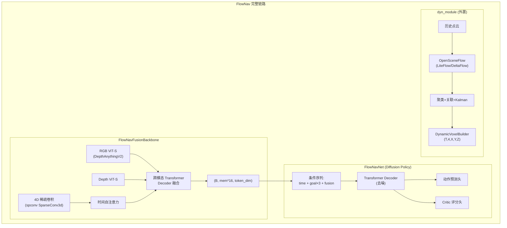
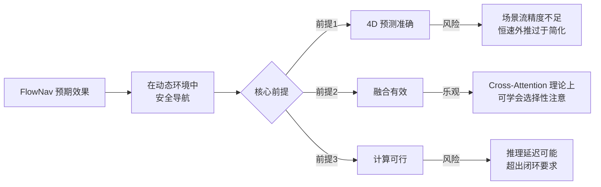

# FlowNav 实现质量辩证分析报告

## 一、总体架构概览

FlowNav 在 NavDP（Navigation Diffusion Policy）基础上进行衍生开发，核心创新点是**将 4D 时空动态占据预测融入导航策略**。整体架构可用下图概括：



---

## 二、优势分析（正面）

### 2.1 架构设计合理性

**✅ 双流融合理念正确。** [`FlowNavFusionBackbone`](internnav/model/encoder/flownav_backbone.py:195) 采用"静态语义流 + 动态物理流"双流架构，通过 Cross-Attention 将未来占据预测注入当前视觉特征空间。这一设计在理论上是合理的：

- **静态语义流**复用 NavDP 已验证的 DepthAnythingV2 ViT-S 骨干，保留了强视觉表征能力
- **动态物理流**使用 spconv 稀疏卷积处理 4D 体素，计算效率远优于密集 3D 卷积
- **跨模态融合**使用 Learnable Query + Transformer Decoder，灵活度高

**✅ 接口兼容性设计出色。** FlowNav 输出严格保持 `(B, memory_size*16, token_dim)` 的 token 序列形状（[`flownav_backbone.py:312`](internnav/model/encoder/flownav_backbone.py:312)），实现了对后端 policy 网络的"无缝欺骗"。这意味着所有下游模块无需修改即可复用 NavDP 的解码、推理、评估逻辑。

**✅ Classifier-Free Guidance 思路。** 保留了 NavDP 原版的 no-goal / mixed-goal 双路训练（[`flownav_policy.py:502-514`](internnav/model/basemodel/flownav/flownav_policy.py:502)），以及确定性的 27 种目标组合采样（[`flownav_policy.py:478-487`](internnav/model/basemodel/flownav/flownav_policy.py:478)），这对 Diffusion Policy 的条件生成质量至关重要。

### 2.2 工程完备性

**✅ 三套训练模式设计完整。** `flownav_static` / `flownav_dyn` / `flownav_mix` 三套配置分支覆盖了从纯静态预训练、动态微调到混合训练的完整课程学习链路。

**✅ 多层回退机制健壮。** [`FlowNavTrainer._resolve_dynamic_voxels()`](internnav/trainer/flownav_trainer.py:195) 实现了三层优先级回退：
1. 优先使用 batch 中已有的 dynamic_voxels（动态数据集）
2. 其次通过 dyn_module 在线构建（静态数据集兜底）
3. 最终回退到零体素（保证训练不中断）

**✅ dyn_module 设计模块化。** [`FlowNavDynamicsRuntime`](internnav/model/encoder/dyn_module/policy_bridge.py:45) 将场景流推理、聚类关联、Kalman 跟踪、体素构建清晰解耦，支持 ROS2 节点接入（[`ros2_node.py`](internnav/model/encoder/dyn_module/ros2_node.py)），具备实际部署潜力。

**✅ 课程学习体素混入。** [`FlowNav_Dyn_Lerobot_Dataset`](internnav/dataset/flownav_dyn_lerobot_dataset.py:115) 实现了 GT↔估计体素的课程学习混合（`est_voxel_ratio`），支持按训练步数线性调度（[`set_est_voxel_ratio_by_step()`](internnav/dataset/flownav_dyn_lerobot_dataset.py:307)），这对弥合训练-部署分布差距有重要意义。

### 2.3 数据引擎规划

**✅ DataEngine 规划全面。** [`Plan.md`](dataengine/Plan.md) 规划了五层架构（场景/动态/规划/记录/调度），并明确了与 FlowNav 数据契约的对齐目标。双专家轨迹（Oracle+Reactive）的设计思路符合模仿学习最佳实践。

---

## 三、问题分析（批判面）

### 3.1 🔴 核心理论风险：4D 预测质量的"鸡与蛋"问题

FlowNav 的核心假设是：**如果能准确预测未来 8 帧的 4D 占据运动场，就能显著提升导航安全性**。但这里存在深层矛盾：

1. **dyn_module 的场景流推理本身就是不精确的。** [`OpenSceneFlowAdapter`](internnav/model/encoder/dyn_module/opensceneflow_adapter.py:49) 依赖 LiteFlow/DeltaFlow 模型，而场景流模型在室内导航场景的精度并无充分验证。当 checkpoint 加载失败时，直接回退为**零流**（[`opensceneflow_adapter.py:173-187`](internnav/model/encoder/dyn_module/opensceneflow_adapter.py:173)），意味着动态分支完全失效。

2. **常速度外推假设过于简化。** [`DynamicVoxelBuilder.build_packet()`](internnav/model/encoder/dyn_module/dynamic_voxel_builder.py:153) 对轨迹做未来 T 帧的**恒速线性外推**（`p_t = pos + v * dt`），对于行人突然转向、车辆刹车等常见动态场景无法有效建模。这使得"未来 4D 运动场"的物理真实性存疑。

3. **训练时 GT 体素 vs 部署时估计体素的分布差距巨大。** 虽然设计了课程学习策略，但从 GT 到嘈杂估计的过渡效果未经验证。如果模型过度依赖准确的 4D 先验，部署时性能可能显著退化。

### 3.2 🔴 计算代价与延迟问题

**spconv 稀疏卷积的实际开销。** [`FlowNavFusionBackbone`](internnav/model/encoder/flownav_backbone.py:273-289) 引入的 spconv 稀疏 3D 卷积虽然理论上高效，但：

- 每帧需要从密集体素构建 `SparseConvTensor`（[`flownav_backbone.py:412-415`](internnav/model/encoder/flownav_backbone.py:412)），涉及 `torch.nonzero()` + 特征提取，开销不可忽略
- 8 帧 × 64 Token = 512 个 physics token + memory_size×256 RGB token + memory_size×256 Depth token → 跨模态解码器的总 KV 序列长度达到 `memory_size*512 + 512`（默认约 4608），**这比 NavDP 原版的 `(memory_size+1)*256`（约 2304）翻了一倍**
- 对 4090 24GB 的推理延迟影响需要实测

**dyn_module 的在线延迟。** [`FlowNavDynamicsRuntime`](internnav/model/encoder/dyn_module/policy_bridge.py:45) 包含完整的场景流推理 + HDBSCAN 聚类 + Kalman 跟踪，即使控制在 7.5Hz heavy_rate，每次重链路的延迟也可能达到数十至数百毫秒，**叠加到 policy 推理延迟上可能导致闭环控制频率不足**。

### 3.3 🟡 代码质量问题

**1. 大量重复的 `_get_device()` 方法。** [`FlowNavNet._get_device()`](internnav/model/basemodel/flownav/flownav_policy.py:541)、[`FlowNavFusionBackbone._get_device()`](internnav/model/encoder/flownav_backbone.py:459)、[`ImageGoalBackbone._get_device()`](internnav/model/encoder/flownav_backbone.py:542)、[`PixelGoalBackbone._get_device()`](internnav/model/encoder/flownav_backbone.py:628) 完全相同的实现被复制了 4 次。应提取为公共 mixin 或工具函数。

**2. `tgt_mask` 和 `cond_critic_mask` 未注册为 buffer。** 在 [`FlowNavNet.__init__()`](internnav/model/basemodel/flownav/flownav_policy.py:235-236) 中，`cond_critic_mask` 作为普通属性存储，需要在 `to()` 中手动迁移（[`flownav_policy.py:247`](internnav/model/basemodel/flownav/flownav_policy.py:247)）。这不符合 PyTorch 最佳实践，应使用 `register_buffer()`。

**3. `cond_pos_embed` 重复计算。** 在 [`forward()`](internnav/model/basemodel/flownav/flownav_policy.py:463-465) 中，`cond_pos_embed` 使用 no-goal 路径的 token 组合计算，然后同时用于 no-goal 和 mixed-goal 两条路径。这在语义上存在不一致——mixed-goal 路径使用了 no-goal 的位置编码。NavDP 原版也有这个问题，但 FlowNav 理应修正。

**4. `predict_noise()` 中条件拼接做了两次 `torch.cat`。** [`flownav_policy.py:363-365`](internnav/model/basemodel/flownav/flownav_policy.py:363):

```python
cond_embedding = torch.cat(
    [time_embeds,goal_embed,goal_embed,goal_embed,fusion_embed],dim=1
) + self.cond_pos_embed(torch.cat([time_embeds,goal_embed,goal_embed,goal_embed,fusion_embed],dim=1))
```

同一个 `torch.cat` 操作执行了两次，浪费计算。应缓存中间结果。

**5. `builtins.print` 全局覆盖。** [`flownav_lerobot_dataset.py:49`](internnav/dataset/flownav_lerobot_dataset.py:49) 通过 `builtins.print = print` 全局覆盖内置打印函数，这是一种**侵入性极强**的做法，可能影响整个进程中所有模块的打印行为，应改为使用 `logging` 模块。

**6. 数据集 `* 50` 硬编码重复。** [`flownav_lerobot_dataset.py:220-223`](internnav/dataset/flownav_lerobot_dataset.py:220) 将数据列表硬编码重复 50 次来扩充样本量，这应该通过 DataLoader 的 sampler 机制实现。

### 3.4 🟡 设计决策的风险点

**1. 取消自回归 mask 的决策需验证。** FlowNav 默认将 `tgt_mask_mode` 设为 `'none'`（[`flownav_policy.py:131`](internnav/model/basemodel/flownav/flownav_policy.py:131)），注释中解释是"允许解码器在去噪过程中同时关注所有条件 token"。但在扩散模型中，完全取消因果掩码是否真的有益，取决于实验验证。NavDP 使用因果掩码可能有其隐含的正则化效果。

**2. goal_embed 重复 3 次的做法。** [`predict_noise()`](internnav/model/basemodel/flownav/flownav_policy.py:363-364) 中将 `goal_embed` 重复 3 次以"保持与 NavDP 的条件结构一致"。但 NavDP 的 3 个位置分别对应 point/image/pixel 三种不同目标类型——简单重复同一个目标嵌入在语义上是不同的操作，可能导致位置编码学到错误的语义。

**3. Critic 设计局限性。** Critic 评分仍然使用了极其简化的启发式公式（[`flownav_lerobot_dataset.py:953-976`](internnav/dataset/flownav_lerobot_dataset.py:953)）：`-5.0 * near_penalty + 0.5 * distance_trend`。对于动态场景，这种基于瞬时距离的 heuristic 无法捕捉"未来碰撞风险"——而这恰恰是 FlowNav 4D 预测应当提供的核心价值。

### 3.5 🟡 数据引擎现状

**DataEngine 目前仍处于场景层开发阶段。** 从代码结构看：
- [`dataengine/src/scene_layer/`](dataengine/src/scene_layer/) 已有较完整的实现（compiler、composer、selector、navmesh 等）
- 但动态层（Dynamics Layer）、规划层（Planning Layer）、记录层（Recording Layer）尚未实现
- 这意味着 **FlowNav 目前还没有真正的动态训练数据**——要么使用静态数据 + dyn_module 在线生成（质量存疑），要么等待 DataEngine 完成

---

## 四、辩证综合评价

### 4.1 能否达到预期效果？



**结论：FlowNav 的设计方向正确但效果存在较大不确定性，主要瓶颈在 4D 预测质量和计算延迟。**

- **乐观场景**：如果 DataEngine 能提供高质量的动态训练数据（含 GT 4D 体素），并且部署场景的动态复杂度不超过训练分布，FlowNav 有望在动态避障方面显著超越纯静态的 NavDP。Cross-Attention 融合机制提供了足够的表达能力。
- **悲观场景**：如果 dyn_module 的场景流精度不足、恒速外推误差过大、或实时计算延迟导致闭环频率下降，FlowNav 可能**不如 NavDP + 简单反应式避障**的组合方案，因为引入了额外的计算开销但未获得可靠的预测增益。

### 4.2 实现质量评级

| 维度 | 评级 | 说明 |
|------|------|------|
| **架构设计** | ⭐⭐⭐⭐ | 双流融合 + 接口兼容 + 模块化 dyn_module，设计合理 |
| **代码质量** | ⭐⭐⭐ | 功能完整但有重复代码、非标准实践、计算浪费 |
| **工程健壮性** | ⭐⭐⭐⭐ | 多层回退机制、课程学习、三套训练模式 |
| **理论基础** | ⭐⭐⭐ | 恒速外推过于简化，Critic heuristic 与 4D 预测脱节 |
| **可验证性** | ⭐⭐ | 缺乏动态训练数据，DataEngine 未完成，无实验结果 |
| **部署可行性** | ⭐⭐⭐ | 有 ROS2 接口设计，但实时性和 GPU 内存需实测 |

### 4.3 关键改进建议

1. **优先完成 DataEngine 动态层**，获取真实的 4D GT 体素训练数据，这是验证 FlowNav 价值的前提
2. **将恒速外推升级为至少常加速度模型**（`p = p0 + v*dt + 0.5*a*dt²`），或者直接利用 Kalman 预测步的协方差做概率膨胀
3. **改进 Critic 监督信号**，使其直接利用 4D 预测——例如用"未来时空碰撞概率"替代"当前帧瞬时距离"
4. **进行消融实验**，分别验证：取消因果掩码、4D 分支、课程学习策略各自的贡献
5. **代码重构**：提取公共 `_get_device()`、注册 buffer、消除重复 `torch.cat`、去除全局 `builtins.print` 覆盖
6. **延迟基准测试**：测量 dyn_module 重链路耗时 + FlowNavFusionBackbone 推理耗时，评估闭环可行性
