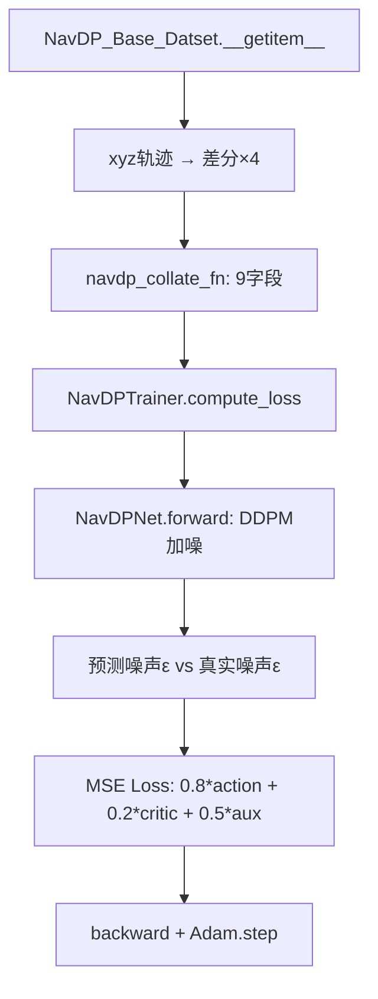
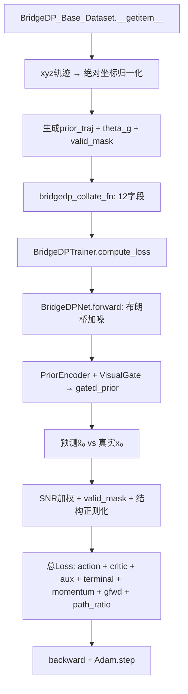
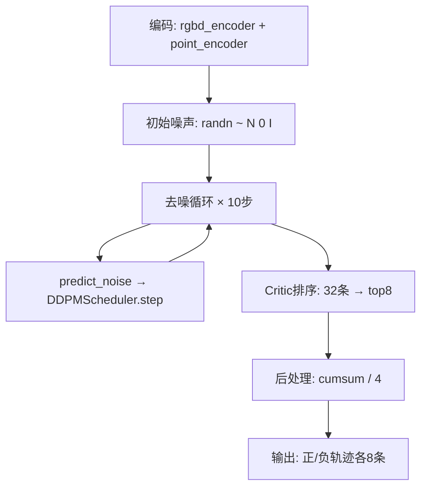
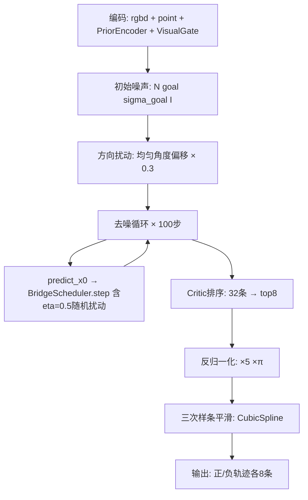

# NavDP vs Bridge-DP 逐文件逐行对比分析报告

> 基于 InternNav 代码库完整源码审读
> 分析日期：2026-05-16

---

## 目录

1. [对比总览](#1-对比总览)
2. [模型策略文件对比](#2-模型策略文件对比)
3. [噪声调度器对比](#3-噪声调度器对比)
4. [Bridge-DP 独有模块分析](#4-bridge-dp-独有模块分析)
5. [训练器对比](#5-训练器对比)
6. [数据集对比](#6-数据集对比)
7. [配置对比](#7-配置对比)
8. [Backbone 编码器共享分析](#8-backbone-编码器共享分析)
9. [训练数据流全链路对比](#9-训练数据流全链路对比)
10. [推理流程全链路对比](#10-推理流程全链路对比)
11. [辩证批判性分析：Bridge-DP 的优劣与改进](#11-辩证批判性分析)
12. [综合评判结论](#12-综合评判结论)

---

## 1. 对比总览

### 1.1 涉及文件清单

| 维度 | NavDP 文件 | Bridge-DP 文件 |
|------|-----------|---------------|
| 模型策略 | `internnav/model/basemodel/navdp/navdp_policy.py` | `internnav/model/basemodel/bridgedp/bridgedp_policy.py` |
| 噪声调度 | `diffusers.DDPMScheduler`（外部库） | `internnav/model/basemodel/bridgedp/bridge_scheduler.py` |
| 先验编码 | 无 | `internnav/model/basemodel/bridgedp/prior_encoder.py` |
| 训练器 | `internnav/trainer/navdp_trainer.py` | `internnav/trainer/bridgedp_trainer.py` |
| 数据集 | `internnav/dataset/navdp_dataset.py` | `internnav/dataset/bridgedp_lerobot_dataset.py` |
| 配置 | `scripts/train/base_train/configs/navdp.py` | `scripts/train/base_train/configs/bridgedp.py` |
| Backbone | `internnav/model/encoder/navdp_backbone.py` | **共用**（完全相同） |
| 模型注册 | `internnav/configs/model/navdp.py` | `internnav/configs/model/bridgedp.py` |
| 训练入口 | `scripts/train/base_train/train.py` | **共用**（通过 `model_name` 分支） |

### 1.2 核心差异速查表

| 维度 | NavDP | Bridge-DP | 变化量级 |
|------|-------|-----------|---------|
| 扩散范式 | 标准 DDPM（纯噪声→数据） | 布朗桥 SDE（目标→数据） | **根本性变化** |
| 动作空间 | 增量×4（差分） | 绝对坐标 (x,y,θ) | **根本性变化** |
| 预测目标 | 噪声 ε | 干净轨迹 x̂₀ | **核心变化** |
| 先验注入 | 无 | PriorEncoder + VisualGate | **新增模块** |
| 方差调度 | 固定 squaredcos_cap_v2 | 方向自适应 σ²(t;θ_g) | **核心变化** |
| 推理初始噪声 | 标准高斯 N(0,I) | 目标中心 N(g, σ²_goal·I) | 重要变化 |
| 后处理 | cumsum/4 | 三次样条平滑 | 重要变化 |
| 训练步数 | 10 步 | 100 步 | 配置变化 |
| 损失函数 | 0.8·action + 0.2·critic + 0.5·aux | 同左 + terminal + momentum + global_fwd + path_ratio | **显著增加** |
| SNR 加权 | 无 | w(t) = 1/σ²(t;θ_g) | 新增 |
| 有效步掩码 | 无 | valid_mask 排除静止填充步 | 新增 |

---

## 2. 模型策略文件对比

### 2.1 文件概要

| 属性 | NavDP (`navdp_policy.py`) | Bridge-DP (`bridgedp_policy.py`) |
|------|--------------------------|--------------------------------|
| 行数 | 340 行 | 819 行（+141%） |
| 类名 | `NavDPNet` | `BridgeDPNet` |
| Config类 | `NavDPModelConfig` (model_type='navdp') | `BridgeDPModelConfig` (model_type='bridgedp') |
| 基类 | `PreTrainedModel` | `PreTrainedModel`（相同） |

### 2.2 Config 类对比

二者结构**完全一致**，仅 `model_type` 不同：

```python
# NavDP
class NavDPModelConfig(PretrainedConfig):
    model_type = 'navdp'
    def __init__(self, **kwargs):
        super().__init__(**kwargs)
        self.model_cfg = kwargs.get('model_cfg', None)

# Bridge-DP — 完全相同结构
class BridgeDPModelConfig(PretrainedConfig):
    model_type = 'bridgedp'
    # ... 同上
```

### 2.3 `from_pretrained` 对比

**完全一致**的加载逻辑，仅类引用不同。

### 2.4 `__init__` 对比（核心差异）

#### 共同部分（相同）

| 组件 | NavDP 行号 | Bridge-DP 行号 | 说明 |
|------|-----------|---------------|------|
| `ModelCfg` 解析 | L69-72 | L124-127 | 完全相同 |
| `_device` 设定 | L74 | L129 | 完全相同 |
| IL 超参读取 | L75-84 | L131-139 | Bridge-DP 无 `input_channels`/`scratch` |
| `RGBDBackbone` | L86-88 | L155-158 | 完全相同 |
| `PixelGoalBackbone` | L89-91 | L159-162 | 完全相同 |
| `ImageGoalBackbone` | L92 | L163 | 完全相同 |
| `point_encoder` | L93 | L164 | 完全相同（nn.Linear(3, token_dim)） |
| RGB backbone 冻结 | L95-98 | L167-170 | 完全相同 |
| Transformer Decoder | L100-109 | L173-182 | **完全相同**结构 |
| `input_embed` | L110 | L183 | 完全相同（nn.Linear(3, token_dim)） |
| `drop` / `time_emb` / `layernorm` | L114-116 | L192-194 | 完全相同 |
| `action_head` / `critic_head` | L117-118 | L197-198 | 完全相同 |
| `pixel_aux_head` / `image_aux_head` | L133-134 | L201-202 | 完全相同 |
| `tgt_mask` 因果掩码 | L122-128 | L218-224 | 完全相同 |

#### Bridge-DP 独有部分

| 组件 | Bridge-DP 行号 | 说明 |
|------|---------------|------|
| `n_prior_tokens` | L142 | 先验token数量，默认4 |
| `sigma_base` | L143 | 数据驱动基础方差，默认1.0 |
| `sigma_goal` | L144 | 弹性尾端方差，默认0.1 |
| `num_train_timesteps` | L145 | 训练步数100（NavDP=10） |
| `num_inference_timesteps` | L146 | 推理步数100（NavDP=10） |
| `use_prior_traj` | L148 | 先验轨迹开关 |
| `action_scale_xy/theta` | L152-153 | 动作归一化参数 |
| `PriorEncoder` | L205-209 | 2层Transformer编码先验轨迹 |
| `VisualGate` | L210 | 视觉门控模块 |
| `BridgeScheduler` | L211-215 | 布朗桥噪声调度器 |
| `cond_pos_embed` 长度 | L188-189 | memory_size*16 + 4 + **n_prior_tokens** |
| `cond_critic_mask` 扩展 | L229-232 | 额外屏蔽 prior tokens |
| `_normalize_action` | L246-258 | 归一化工具方法 |
| `_denormalize_action` | L260-272 | 反归一化工具方法 |

#### 关键差异：NavDP 有但 Bridge-DP 无

| NavDP 组件 | NavDP 行号 | 说明 |
|-----------|-----------|------|
| `self.scratch` | L84 | Bridge-DP 不读取 scratch 参数 |
| `self.input_channels` | L81 | Bridge-DP 不读取 channels 参数 |
| `DDPMScheduler` | L119-121 | 被 BridgeScheduler 替代 |

### 2.5 `sample_noise` / `sample_bridge_noise` 对比

```
NavDP sample_noise(action):
  1. 生成随机噪声 ε ~ N(0,I)
  2. 随机采样时间步 t ~ U{0,...,T-1}
  3. x_t = DDPMScheduler.add_noise(action, noise, t)
  4. 返回 (noise, time_embed, noisy_action_embed)

Bridge-DP sample_bridge_noise(x0, goal, theta_g, timesteps=None):
  1. 可选使用预生成时间步（ng/mg 共享）
  2. 生成随机噪声 ε ~ N(0,I)
  3. x_t = BridgeScheduler.add_noise(x0, goal, theta_g, t, noise)
     即 x_t = (1-t)·x0 + t·g + σ(t;θ_g)·ε
  4. 返回 (x0, time_embed, noisy_action_embed, timesteps)
```

**核心差异**：
- NavDP 返回**噪声 ε**作为训练目标
- Bridge-DP 返回**干净轨迹 x₀**作为训练目标
- Bridge-DP 加噪公式包含**目标 g** 和**方向自适应方差 σ(t;θ_g)**
- Bridge-DP 共享时间步（ng/mg 使用相同 timesteps），NavDP 各自独立采样

### 2.6 `predict_noise` / `predict_x0` 对比

```
NavDP predict_noise(last_actions, timestep, goal_embed, rgbd_embed):
  memory = [time, goal×3, rgbd]  # 4 + memory_size*16 tokens
  output = decoder(tgt=action_embed, memory=cond_embed)
  return action_head(output)  # 预测噪声 ε

Bridge-DP predict_x0(noisy_actions, timestep, goal_embed, rgbd_embed, prior_embed):
  memory = [time, goal×3, rgbd, G·prior]  # 4 + memory_size*16 + n_prior tokens
  output = decoder(tgt=action_embed, memory=cond_embed)
  return action_head(output)  # 预测干净轨迹 x̂₀
```

**核心差异**：
- Bridge-DP memory 序列**多了 prior_embed**（门控后的先验 token）
- 输出语义不同：噪声 vs 干净轨迹

### 2.7 `predict_critic` 对比

**结构完全一致**，Bridge-DP 多出 `zero_prior` 填充以保持 memory 长度对齐，且 `cond_critic_mask` 额外屏蔽了 prior token 位置。Critic 分支**不使用先验信息**，设计合理。

### 2.8 `forward` 对比（训练前向）

| 步骤 | NavDP | Bridge-DP | 差异 |
|------|-------|-----------|------|
| 输入参数 | 7个 | **9个**（+prior_traj, theta_g） | Bridge-DP 新增 |
| 加噪方式 | `sample_noise` × 2（独立采样） | `sample_bridge_noise` × 2（**共享timesteps**） | 核心差异 |
| 视觉编码 | rgbd/point/image/pixel | 完全相同 | 无差异 |
| 先验处理 | 无 | PriorEncoder → VisualGate → gated_prior | Bridge-DP 新增 |
| Memory 构建 | [time, goal×3, rgbd] | [time, goal×3, rgbd, **gated_prior**] | Bridge-DP 扩展 |
| Goal 混合策略 | 3³=27 组合（确定性） | **完全相同** | 无差异 |
| Decoder 前向 | ng + mg + critic×2 | **完全相同**结构 | 无差异 |
| 返回值 | 8个（含 ng_noise, mg_noise） | **10个**（含 x0_ng, x0_mg, shared_timesteps, theta_g） | Bridge-DP 扩展 |

### 2.9 推理接口对比

#### `predict_pointgoal_batch_action_vel`

| 步骤 | NavDP | Bridge-DP |
|------|-------|-----------|
| 初始噪声 | `torch.randn(...)` 标准高斯 | `bridge_scheduler.sample_initial_noise(goal, ...)` 即 N(g, σ²_goal·I) |
| 方向扰动 | 无 | 均匀方向偏移（方案C） |
| 去噪循环 | `predict_noise → DDPMScheduler.step` | `predict_x0 → BridgeScheduler.step` |
| 后处理 | `cumsum(naction/4.0, dim=1)` 累积和 | `_denormalize_action → smooth_trajectory_batch`（三次样条） |
| Critic排序 | 相同 | 相同 |
| 返回 | negative/positive 各 8 条 | 相同 |

---

## 3. 噪声调度器对比

### 3.1 文件对比

| 属性 | NavDP (DDPMScheduler) | Bridge-DP (BridgeScheduler) |
|------|----------------------|---------------------------|
| 来源 | `diffusers` 外部库 | 自实现 `bridge_scheduler.py`（342行） |
| 范式 | 标准 DDPM（前向加噪→纯噪声） | 布朗桥 SDE（前向加噪→目标附近） |
| 预测模式 | `prediction_type='epsilon'`（预测噪声） | 预测 x̂₀（干净轨迹） |
| β-schedule | `squaredcos_cap_v2` | 无β-schedule，使用解析公式 |
| 训练步数 | 10 | 100 |

### 3.2 前向加噪对比

```
NavDP DDPMScheduler.add_noise(action, noise, timesteps):
  # 基于预计算的 αbar 累乘系数
  x_t = √(ᾱ_t) · x_0 + √(1-ᾱ_t) · ε

Bridge-DP BridgeScheduler.add_noise(x0, goal, theta_g, timesteps, noise):
  t = (timesteps + 1) / T   # 归一化到 (0, 1]
  bridge_mean = (1-t) · x_0 + t · g
  σ = √(σ²_base · [t(1-t)]^{p(θ_g)} + t² · σ²_goal)
  x_t = bridge_mean + σ · ε
```

**本质差异**：
- NavDP：t=T 时 x_T ≈ 纯噪声
- Bridge-DP：t=1 时 x_1 ≈ g + σ_goal·ε（围绕目标波动）

### 3.3 反向去噪对比

```
NavDP DDPMScheduler.step(model_output=noise_pred, timestep=k, sample=x_t):
  # 基于 DDPM 公式反向一步
  x_{t-1} = (1/√α_t)(x_t - β_t/√(1-ᾱ_t) · ε_pred) + σ_t · z

Bridge-DP BridgeScheduler.step(x0_pred, x_t, timestep, goal, theta_g, eta=0.5):
  t_prev = t - dt
  x_det = (t_prev/t) · x_t + (dt/t) · x̂_0   # DDIM 确定性
  x_{t-1} = x_det + η · σ(t_prev; θ_g) · ε'   # 可选随机扰动
  # 特殊情况：t ≤ dt 时直接返回 x̂_0
```

### 3.4 方向自适应方差

Bridge-DP 独有的方差调度机制：

```
p(θ_g) = 0.5 + 0.3 · cos(θ_g)
σ²(t; θ_g) = σ²_base · [t(1-t)]^{p(θ_g)} + t² · σ²_goal
```

| 目标方向 | θ_g | p | σ(t=0.5) 相对幅度 |
|---------|-----|---|-----------------|
| 正前方 | 0° | 0.80 | 小（信任桥均值） |
| 正侧方 | 90° | 0.50 | 中等 |
| 正后方 | 180° | 0.20 | 大（允许绕行） |

---

## 4. Bridge-DP 独有模块分析

### 4.1 PriorEncoder (`prior_encoder.py` L21-148)

- **架构**：线性投影(3→d) → 位置编码 → 2层 TransformerEncoder → 交叉注意力压缩(T→N_p)
- **参数量**：约 embed_dim=384 时，额外增加 ~1.5M 参数
- **输入**：先验轨迹 (B, T, 3)
- **输出**：压缩token (B, N_p, d)，N_p=4

### 4.2 VisualGate (`prior_encoder.py` L151-209)

- **架构**：MLP(d→128→1) + sigmoid
- **初始化偏置**：bias=1.0 → 初始 G ≈ 0.73（默认信任先验）
- **输入**：视觉全局特征 (B, d)（rgbd_embed 的 mean pooling）
- **输出**：门控值 (B, 1, 1)

### 4.3 额外参数量估算

| 模块 | 参数量（d=384） |
|------|---------------|
| PriorEncoder.input_proj | 384×3 = 1,152 |
| PriorEncoder.pos_embed | 64×384 = 24,576 |
| PriorEncoder.transformer (2层) | ~1.2M |
| PriorEncoder.query_tokens | 4×384 = 1,536 |
| PriorEncoder.cross_attn | ~0.6M |
| PriorEncoder.cross_ffn | ~1.2M |
| VisualGate.mlp | 384×128 + 128×1 ≈ 49K |
| **总计** | **~3.1M** |

NavDP 总参数约 ~80M（含冻结的 RGB backbone），Bridge-DP 额外增加约 3.1M（+3.9%）。

---

## 5. 训练器对比

### 5.1 文件概要

| 属性 | NavDPTrainer | BridgeDPTrainer |
|------|-------------|-----------------|
| 行数 | 349 行 | 406 行（+16%） |
| 基类 | BaseTrainer (transformers.Trainer) | BaseTrainer（相同） |

### 5.2 `compute_loss` 对比（核心差异）

#### 输入字段

| 字段 | NavDP | Bridge-DP |
|------|-------|-----------|
| batch_pg/ig/tg/rgb/depth | ✓ | ✓ |
| batch_labels/augments | ✓ | ✓ |
| batch_label_critic/augment_critic | ✓ | ✓ |
| **batch_prior** | ✗ | ✓（新增） |
| **batch_theta_g** | ✗ | ✓（新增） |
| **batch_valid_mask** | ✗ | ✓（新增） |

#### 前向调用

```python
# NavDP — 7 个输入，8 个输出
pred_ng, pred_mg, critic_pred, augment_pred, ng_noise, mg_noise, img_aux, pix_aux = model(
    pg, ig, tg, rgb, depth, labels, augments
)

# Bridge-DP — 9 个输入，10 个输出
(x0_pred_ng, x0_pred_mg, critic_pred, augment_pred,
 x0_target_ng, x0_target_mg, img_aux, pix_aux,
 shared_timesteps, tensor_theta_g) = model(
    pg, ig, tg, rgb, depth, labels, augments, prior, theta_g
)
```

#### 损失计算对比

**NavDP 损失**（`navdp_trainer.py` L140-160）：

```python
ng_action_loss = (pred_ng - ng_noise).square().mean()     # 噪声回归 MSE
mg_action_loss = (pred_mg - mg_noise).square().mean()
action_loss = 0.5 * mg_action_loss + 0.5 * ng_action_loss
aux_loss = 0.5 * (pg - img_aux).square().mean() + 0.5 * (pg - pix_aux).square().mean()
critic_loss = (critic_pred - label_critic).square().mean() + (augment_pred - augment_critic).square().mean()
loss = 0.8 * action_loss + 0.2 * critic_loss + 0.5 * aux_loss
```

**Bridge-DP 损失**（`bridgedp_trainer.py` L121-208）：

```python
# 1. SNR 加权
variance = bridge_scheduler.variance(t_norm, theta_g)
snr_weight = (1.0 / variance.clamp(min=0.01))
snr_weight = snr_weight / snr_weight.mean()  # 归一化

# 2. 有效步掩码
valid_mask[:, 0] = 0.0  # 起点不参与
ng_pointwise = (x0_pred_ng - x0_target_ng).square().mean(dim=-1)
weighted_ng = snr_weight * valid_mask * ng_pointwise
ng_action_loss = weighted_ng.sum() / valid_count

# 3. 轨迹结构正则化（NavDP 无）
terminal_loss    = (pred_avg[:,-1,:2] - target_avg[:,-1,:2]).square().mean()
momentum_loss    = linear_accel_loss + angular_accel_loss
global_fwd_loss  = relu(end_dist - start_dist + 0.1).mean()
path_ratio_loss  = relu(pred_len / gt_len - 1.5).mean()

# 4. 总损失
loss = (0.8  * action_loss
      + 0.2  * critic_loss
      + 0.5  * aux_loss
      + 0.2  * terminal_loss
      + 0.1  * momentum_loss
      + 0.05 * global_forward_loss
      + 0.02 * path_ratio_loss)
```

#### 损失权重对比总表

| 损失项 | NavDP 权重 | Bridge-DP 权重 | 说明 |
|--------|-----------|---------------|------|
| action_loss | 0.8 | 0.8 | 相同，但内部有 SNR 加权+valid_mask |
| critic_loss | 0.2 | 0.2 | 完全相同 |
| aux_loss | 0.5 | 0.5 | 完全相同 |
| terminal_loss | — | 0.2 | Bridge-DP 新增 |
| momentum_loss | — | 0.1 | Bridge-DP 新增 |
| global_forward_loss | — | 0.05 | Bridge-DP 新增 |
| path_ratio_loss | — | 0.02 | Bridge-DP 新增 |

### 5.3 其他方法对比

| 方法 | NavDP | Bridge-DP | 差异 |
|------|-------|-----------|------|
| `create_optimizer` | Adam, lr from config | 完全相同 | 无 |
| `create_scheduler` | LinearLR, 1.0→0.5, 10000步 | 完全相同 | 无 |
| `get_train_dataloader` | DistributedSampler + DataLoader | 完全相同 | 无 |
| `save_model` | navdp.ckpt | bridgedp.ckpt | 仅文件名不同 |
| `log` | 注入 _monitor_logs | 完全相同逻辑 | 无 |
| `_write_traj_snapshot` | 写入 gt/pred/labels | 写入 gt/pred/**prior**/labels/**theta_g** | Bridge-DP 字段更丰富 |
| `_compute_grad_norm` | 无 | ✓（新增） | Bridge-DP 监控梯度 |

---

## 6. 数据集对比

### 6.1 文件概要

| 属性 | NavDP (`navdp_dataset.py`) | Bridge-DP (`bridgedp_lerobot_dataset.py`) |
|------|---------------------------|----------------------------------------|
| 行数 | 424 行 | 759 行（+79%） |
| 类名 | `NavDP_Base_Datset` | `BridgeDP_Base_Dataset` |
| 数据格式 | data.json + RGB/Depth 文件夹 | Parquet + LeRobot 目录结构 |

### 6.2 `__init__` 对比

| 差异点 | NavDP | Bridge-DP |
|--------|-------|-----------|
| `root_dirs` 参数 | 列表（多个目录） | 单个目录（内部遍历） |
| `trajectory_dirs` | ✓ | ✗（不保存目录列表） |
| `trajectory_afford_path` | ✓ | ✓ |
| `action_dim` | 隐式=3 | 显式参数，默认3 |
| `sigma_base` | 无 | ✓（数据驱动常数） |
| `action_scale_xy/theta` | 无 | ✓（归一化参数） |
| `pixel_channel` | 隐式 | 显式参数 |
| 数据格式解析 | 新/旧格式两分支 | 新/旧格式两分支（更复杂） |
| 数据复制 | ×50 | ×50（相同） |

### 6.3 数据加载方法对比

| 方法 | NavDP | Bridge-DP | 差异 |
|------|-------|-----------|------|
| `load_image` | PIL → uint8 | 相同 + 异常处理 | Bridge-DP 更健壮 |
| `load_depth` | PIL → uint16 | 相同 + 异常处理 | Bridge-DP 更健壮 |
| `process_image` | resize+pad+normalize | **完全相同** | 无 |
| `process_depth` | resize+pad+filter | **完全相同** | 无 |
| `relative_pose` | 完整矩阵运算 | **简化** R_base.T @ (T_world - T_base) | **不同实现** |
| `absolute_pose` | 完整矩阵运算 | **简化** R_base @ T_frame + T_base | **不同实现** |
| `xyz_to_xyt` | 简单差分+arctan2 | **带插值修复**：重复点线性插值theta | Bridge-DP 更鲁棒 |
| `process_actions` | 固定 clip 采样 | **动态采样**：短轨迹clip，长轨迹linspace | Bridge-DP 更智能 |
| `rank_steps` | 需外部调用参数 | 完全自包含 | Bridge-DP 更规范 |
| `process_pixel_from_bytes` | 直接投影 | 重命名为 `process_pixel_goal`，简化实现 | 不同实现 |

### 6.4 `__getitem__` 核心差异

#### NavDP 动作处理（L387-388）

```python
pred_actions = (pred_actions[1:] - pred_actions[:-1]) * 4.0    # 差分×4
augment_actions = (augment_actions[1:] - augment_actions[:-1]) * 4.0
```

#### Bridge-DP 动作处理（L661-695）

```python
pred_actions = pred_actions[1:]   # 绝对坐标，去掉起点

# 有效步掩码
step_diffs = np.linalg.norm(pred_actions[1:,:2] - pred_actions[:-1,:2], axis=-1)
valid_mask = np.concatenate([[1.0], (step_diffs > 1e-4).astype(np.float32)])

# 目标方位角
theta_g = np.arctan2(point_goal[1], point_goal[0])

# 归一化
pred_actions[:, 0:2] /= action_scale_xy    # 除以 5.0
pred_actions[:, 2] /= action_scale_theta   # 除以 π

# 先验轨迹生成
prior_traj = generate_prior_trajectory(pred_actions, is_task_start)
```

#### 先验轨迹生成策略 (`generate_prior_trajectory`)

```python
if is_task_start:
    return zeros(T, 3)           # 首帧无先验
elif random() < 0.7:
    prior = linspace(0→end) + 0.5%噪声   # 70% 正确先验
else:
    prior = random_rotate(60°~300°) @ gt  # 30% 错误先验
```

### 6.5 返回值对比

| 索引 | NavDP | Bridge-DP | 差异 |
|------|-------|-----------|------|
| 0 | point_goal (3,) | point_goal (3,) **已归一化** | 归一化 |
| 1-4 | image_goal/pixel_goal/memory/depth | 完全相同 | 无 |
| 5 | pred_actions **差分×4** | pred_actions **绝对坐标归一化** | **核心差异** |
| 6 | augment_actions **差分×4** | augment_actions **绝对坐标归一化** | **核心差异** |
| 7-8 | pred_critic / augment_critic | 完全相同 | 无 |
| 9 | — | pixel_flag (float) | Bridge-DP 新增 |
| 10 | — | prior_traj (T,3) | Bridge-DP 新增 |
| 11 | — | theta_g (scalar) | Bridge-DP 新增 |
| 12 | — | valid_mask (T,) | Bridge-DP 新增 |

### 6.6 Collate 函数对比

```python
# NavDP: 9 个字段
navdp_collate_fn: batch_pg/ig/tg/rgb/depth/labels/augments/label_critic/augment_critic

# Bridge-DP: 12 个字段（+3）
bridgedp_collate_fn: 上述 9 个 + batch_prior + batch_theta_g + batch_valid_mask
```

---

## 7. 配置对比

### 7.1 超参数差异

| 参数 | NavDP | Bridge-DP | 说明 |
|------|-------|-----------|------|
| name | 'navdp_train' | 'bridgedp_train' | 实验名 |
| model_name | 'navdp' | 'bridgedp' | 分支标识 |
| model | navdp_cfg | bridgedp_cfg | 模型配置 |
| **sigma_base** | — | 0.0813 | 数据驱动（离线计算） |
| **sigma_goal** | — | 0.001 | 极小值 → 强终点约束 |
| **n_prior_tokens** | — | 4 | 先验token数 |
| **num_train_timesteps** | 10 (DDPM内部) | 100 | **10倍增加** |
| **num_inference_timesteps** | 10 (DDPM内部) | 100 | **10倍增加** |
| **use_prior_traj** | — | False | **当前关闭** |
| dataset_3dgs_root_dir | '' | — | NavDP 有但 Bridge-DP 无 |
| dataset_grutopia10_root_dir | '' | — | NavDP 有但 Bridge-DP 无 |
| save_interval_epochs | 5 | — | NavDP 有但 Bridge-DP 无 |
| lmdb_map_size | 1e12 | 1e12 | 相同 |

### 7.2 完全相同的参数（26项）

epochs=1000, batch_size=32, lr=1e-4, num_workers=4, weight_decay=1e-4, warmup_ratio=0.05, use_iw=True, inflection_weight_coef=3.2, image_size=224, memory_size=8, predict_size=24, pixel_channel=4, temporal_depth=16, heads=8, token_dim=384, channels=3, dropout=0.1, scratch=False, finetune=False, ddp_find_unused_parameters=True, filter_failure(use=True, min_rgb_nums=15), loss(alpha=0.0001, dist_scale=1), seed=0, success_distance=3.0, max_steps=195, step_interval=50

---

## 8. Backbone 编码器共享分析

Bridge-DP 与 NavDP **完全共用** `navdp_backbone.py` 中的所有编码器：

| 编码器 | 功能 | 参数量 | 共享? |
|--------|------|--------|-------|
| `RGBDBackbone` | 历史 RGB+Depth → memory tokens | ~50M | ✓ |
| `ImageGoalBackbone` | 目标图像(6ch) → 1 token | ~10M | ✓ |
| `PixelGoalBackbone` | 像素目标(4ch) → 1 token | ~10M | ✓ |
| `SinusoidalPosEmb` | 时间步 → d 维嵌入 | 0 | ✓ |
| `LearnablePositionalEncoding` | 序列位置编码 | ~2M | ✓（但长度不同） |

**唯一差异**：`cond_pos_embed` 的长度不同：
- NavDP：`memory_size*16 + 4 = 132`
- Bridge-DP：`memory_size*16 + 4 + n_prior_tokens = 136`

---

## 9. 训练数据流全链路对比

### NavDP 训练链路



### Bridge-DP 训练链路



### 关键链路差异总结

| 环节 | NavDP | Bridge-DP |
|------|-------|-----------|
| 数据预处理 | 差分×4 | 绝对坐标 + 归一化(/5, /π) |
| collate | 9字段 | 12字段 |
| 加噪 | DDPM αbar系数 | 布朗桥 (1-t)x₀+tg+σε |
| 先验 | 无 | PriorEncoder→VisualGate→gated_prior |
| 预测目标 | ε（噪声） | x̂₀（干净轨迹） |
| 损失加权 | 均匀 MSE | SNR加权 + valid_mask |
| 结构约束 | 无 | 4项正则化 |
| 总损失项 | 3项 | 7项 |

---

## 10. 推理流程全链路对比

### NavDP 推理



### Bridge-DP 推理



### 推理效率对比

| 维度 | NavDP | Bridge-DP | 影响 |
|------|-------|-----------|------|
| 去噪步数 | 10 | 100 | **10倍慢** |
| 每步前向 | predict_noise（无prior） | predict_x0（含prior编码） | ~5%额外开销 |
| 后处理 | cumsum（O(T)） | CubicSpline（O(T)但含CPU转移） | Bridge-DP略慢 |
| 总推理时间 | 基准 | **约10-12倍** | **严重劣势** |

---

## 11. 辩证批判性分析

### 11.1 Bridge-DP 的理论优势

#### ✅ 优势 1：目标导向的扩散先验

布朗桥将扩散过程锚定在起点和目标之间，比 DDPM 的纯噪声起点提供了更强的归纳偏置：
- 推理时从目标附近开始去噪，收敛方向明确
- 桥均值 (1-t)x₀ + tg 提供了合理的初始猜测

#### ✅ 优势 2：绝对坐标消除累积误差

NavDP 使用差分×4 再 cumsum/4 还原，每步预测误差会累积：
- 第 i 步误差 = Σ_{j=1}^{i} ε_j / 4
- 24 步后累积误差可能很大

Bridge-DP 直接预测绝对坐标，每步独立：
- 第 i 步误差 = ε_i（不累积）
- 远端点精度更高

#### ✅ 优势 3：方向自适应方差

根据目标方位角动态调整方差是一个合理的设计：
- 前方目标→小方差→更精确
- 后方目标→大方差→更灵活
- 比 DDPM 固定的 β-schedule 更适合导航场景

#### ✅ 优势 4：三次样条平滑保证运动连续性

C² 连续性保证对于真实机器人控制很重要，NavDP 的 cumsum 不保证曲率连续。

### 11.2 Bridge-DP 的潜在劣势与不合理之处

#### ❌ 问题 1：推理速度严重下降（最关键）

**配置中 `num_train_timesteps=100, num_inference_timesteps=100`，而 NavDP 仅 10 步**。

推理时间增加约 10 倍，这对于实时导航系统是**致命**的。NavDP 的 10 步 DDPM 已被验证足够，Bridge-DP 是否真的需要 100 步？

**批判**：布朗桥的 DDIM 确定性采样理论上应该比 DDPM 需要**更少**的步数（因为有端点约束），100 步的配置与理论优势矛盾。这可能是开发者对收敛性缺乏信心的保守选择，但会严重损害实用性。

#### ❌ 问题 2：`use_prior_traj=False` — 核心创新被关闭

配置中 `use_prior_traj=False`，意味着 PriorEncoder 和 VisualGate 模块在训练时**完全不工作**（用零填充）。这些模块的参数虽然存在于网络中，但：
- 不参与有意义的前向传播
- 梯度为零或接近零
- 推理时同样不工作

**批判**：Bridge-DP 最核心的创新之一（先验轨迹注入）被完全禁用，使得 Bridge-DP 退化为"不带先验的布朗桥扩散"。额外的 ~3.1M 参数浪费且可能干扰训练。

#### ❌ 问题 3：`sigma_goal=0.001` 过小

配置中 σ_goal = 0.001，极其接近零。这意味着：
- 布朗桥终点方差 = t² × 0.001² ≈ 0（对已归一化的坐标来说几乎是硬约束）
- 推理初始噪声 x_T ≈ g + 0.001·ε ≈ g（几乎没有探索空间）
- **NoGoal 模式下不合理**：goal=0 + σ_goal=0.001 → 所有轨迹起点几乎都在原点附近

**批判**：σ_goal 应在 PointGoal 模式下适中（如 0.1），在 NoGoal 模式下很大（如 10.0）。当前的 0.001 过度约束了终点，可能导致探索多样性不足。

#### ❌ 问题 4：`sigma_base=0.0813` 可能过小

σ_base 由 `compute_sigma_base.py` 离线计算，为训练集轨迹偏差的 95 分位数。数值 0.0813 说明大多数轨迹与桥均值偏差很小。但问题是：
- 在归一化空间中（坐标除以 5.0），0.0813 对应实际偏差约 0.4m
- 方差 σ² = 0.0813² × [t(1-t)]^p ≈ 0.0066 × [t(1-t)]^p
- 在 t=0.5 时最大方差约 0.0066 × 0.25^{0.5} ≈ 0.0033
- 标准差约 0.057 → 在归一化空间中仅允许 ±0.17 的偏差

**批判**：这个方差预算可能不足以支撑复杂避障场景。如果训练集中大部分轨迹是简单直行，计算出的 σ_base 就无法覆盖需要大幅绕行的困难场景。

#### ❌ 问题 5：损失函数过于复杂

Bridge-DP 有 **7 项**损失（NavDP 仅 3 项），包括多个需要人工调权的正则化项。这带来的风险：
- 权重调参空间爆炸（7 个系数的组合）
- 不同正则化项可能梯度冲突
- `momentum_loss` 惩罚加速度变化，但真实避障场景**可能需要**急转弯
- `global_forward_loss` 惩罚末端远离目标，但绕行路径的中间段本就可能远离目标

**批判**：过多的人工正则化约束反映了网络本身学习能力的不足，可能是因为布朗桥的基础训练信号不够强。NavDP 用简单的 3 项损失就能工作，说明 DDPM 范式的训练信号更直接有效。

#### ❌ 问题 6：`relative_pose` 实现被简化，可能引入精度损失

NavDP 的 `relative_pose` 使用完整的 4×4 齐次矩阵变换：

```python
homo_RT = np.eye(4)
homo_RT[0:3,0:3] = R_base
homo_RT[0:3,3] = T_base
T_frame = np.dot(np.linalg.inv(homo_RT), np.array([*T_world,1]).T)[0:3]
T_frame = np.array([T_frame[1], -T_frame[0], T_frame[2]])
```

Bridge-DP 简化为：

```python
R_rel = R_base.T @ R_world
T_rel = R_base.T @ (T_world - T_base)
```

**批判**：NavDP 的实现考虑了坐标轴置换（`[T[1], -T[0], T[2]]`），Bridge-DP 的简化实现**可能遗漏了这个坐标变换**，导致在某些坐标系约定下轨迹方向不正确。这是一个潜在的 bug。

#### ❌ 问题 7：三次样条平滑的 CPU 瓶颈

`smooth_trajectory_batch` 使用 `scipy.interpolate.CubicSpline`，需要：
1. 将 GPU tensor 转到 CPU（`trajectories[b].cpu().numpy()`）
2. 逐样本逐维度拟合（`for b in range(B): for d in range(D):`）
3. 将结果转回 GPU

**批判**：batch=32, T=24, D=3 时需要 96 次 CubicSpline 拟合 + 32 次 GPU↔CPU 传输。这个操作不可微分、不可并行，是推理链路的瓶颈。

#### ❌ 问题 8：ng/mg 共享 timesteps 削弱了训练多样性

```python
shared_timesteps = torch.randint(0, T, (B,), device=device).long()
x0_ng, ng_time_embed, ng_noisy_embed, shared_timesteps = self.sample_bridge_noise(
    tensor_label_actions, tensor_point_goal, tensor_theta_g, timesteps=shared_timesteps
)
x0_mg, mg_time_embed, mg_noisy_embed, _ = self.sample_bridge_noise(
    tensor_label_actions, tensor_point_goal, tensor_theta_g, timesteps=shared_timesteps
)
```

NavDP 的 ng/mg 各自独立采样时间步，Bridge-DP 共享同一组。这减少了每 batch 中覆盖的时间步多样性。

### 11.3 Bridge-DP 的改进潜力

#### 🔧 改进 1：减少推理步数到 10-20 步

布朗桥的端点约束提供了更强的先验，理论上应该能用更少步数收敛。建议：
- 实验验证 10/20/50 步的推理质量
- 采用 DDIM 加速（当前 step 函数已支持 eta 参数）
- 目标：推理速度与 NavDP 持平

#### 🔧 改进 2：启用先验轨迹模块

将 `use_prior_traj=True`，这是 Bridge-DP 的核心创新：
- 需要在数据集中提供真实的先验轨迹（非模拟）
- 对抗训练比例可以从 30% 开始调
- 若先验模块有效，可能显著提升时序一致性

#### 🔧 改进 3：自适应 sigma_goal

- PointGoal 模式：σ_goal = 0.1（允许适度终点偏移）
- NoGoal 模式：σ_goal = 5.0（接近自由扩散）
- 可根据目标距离动态调整

#### 🔧 改进 4：简化损失函数

移除或降权 momentum_loss 和 path_ratio_loss：
- 这些约束可能限制了网络学习复杂避障路径的能力
- 用 terminal_loss 单项替代多项正则化
- 简化为 4 项损失：action + critic + aux + terminal

#### 🔧 改进 5：用 PyTorch 实现样条平滑

将 `smooth_trajectory_batch` 从 scipy 迁移到 PyTorch：
- 使用可微的 B-样条基函数
- 支持 GPU 并行计算
- 可选择将平滑操作纳入训练 pipeline

#### 🔧 改进 6：验证 relative_pose 坐标变换

对比 NavDP 和 Bridge-DP 的 `relative_pose` 输出：
- 用相同的输入数据跑两个版本
- 检查是否存在坐标轴置换遗漏
- 修复可能的 bug

#### 🔧 改进 7：增大 sigma_base 或使用学习型方差

- 当前 σ_base=0.0813 可能过小
- 考虑使用训练集偏差的 99 分位数
- 或者让网络学习方差（但需避免崩塌）

#### 🔧 改进 8：ng/mg 独立采样时间步

恢复 NavDP 的独立采样策略，增加训练多样性。

---

## 12. 综合评判结论

### 12.1 Bridge-DP 训练后是否会比 NavDP 更优秀？

**短期答案：大概率不会，甚至可能更差。**

理由：

1. **核心创新被禁用**：`use_prior_traj=False` 意味着 PriorEncoder 和 VisualGate 不工作，Bridge-DP 退化为"布朗桥 + 绝对坐标"版本的 NavDP，没有发挥先验轨迹注入的优势。

2. **推理速度严重下降**：100 步去噪是 NavDP 10 步的 10 倍，实时导航中不可接受。即使轨迹质量有所提升，延迟增加也会导致实际导航性能下降。

3. **过度复杂的损失函数**：7 项损失的调参难度远高于 3 项，且多个正则化项可能互相冲突，增加训练不稳定风险。

4. **σ_goal 和 σ_base 的配置问题**：σ_goal=0.001 几乎是硬终点约束，σ_base=0.0813 可能不足以覆盖困难场景，这削弱了布朗桥的灵活性优势。

5. **坐标变换可能存在 bug**：`relative_pose` 的简化实现可能遗漏了坐标轴变换。

### 12.2 Bridge-DP 在什么条件下可能超越 NavDP？

如果以下条件**全部满足**，Bridge-DP 有潜力超越 NavDP：

1. ✅ 启用 `use_prior_traj=True`，且先验轨迹质量可靠
2. ✅ 将推理步数降到 10-20 步（验证收敛性）
3. ✅ 调整 σ_goal 到 0.1（PointGoal）/ 5.0（NoGoal）
4. ✅ 简化损失函数到 4 项
5. ✅ 修复 `relative_pose` 坐标变换问题
6. ✅ 将 CubicSpline 迁移到 GPU
7. ✅ σ_base 验证或增大

### 12.3 Bridge-DP 的根本性设计评价

| 设计决策 | 评价 | 置信度 |
|---------|------|--------|
| 布朗桥替代 DDPM | **理论正确，实现有瑕疵** | 高 |
| 绝对坐标替代差分 | **正确**，消除累积误差 | 高 |
| 预测 x₀ 替代预测 ε | **合理**，与布朗桥范式匹配 | 高 |
| 方向自适应方差 | **创新且合理** | 中 |
| PriorEncoder + VisualGate | **设计优秀但未启用** | 高 |
| 三次样条后处理 | **必要但实现低效** | 高 |
| SNR 加权损失 | **理论正确** | 中 |
| 100步去噪 | **不合理，应大幅减少** | 高 |
| σ_goal=0.001 | **过小，需要调整** | 高 |
| 7项复杂损失 | **过度工程化** | 高 |

### 12.4 最终结论

Bridge-DP 在**理论设计层面**有多处创新（布朗桥先验、方向自适应方差、绝对坐标、先验注入），但在**工程实现层面**存在多个关键问题（核心模块被禁用、推理速度大幅下降、超参配置不合理、损失过度复杂）。

在当前配置下训练，**Bridge-DP 大概率不如 NavDP**。但如果按照第 11.3 节的改进建议进行系统性调优，Bridge-DP 有潜力在**长程导航**和**动态环境**场景下超越 NavDP。

关键行动建议（优先级排序）：
1. 🔴 **修复 sigma_goal 配置** — 从 0.001 调到 0.1
2. 🔴 **减少推理步数** — 从 100 步降到 10-20 步
3. 🟠 **启用先验轨迹** — use_prior_traj=True
4. 🟠 **验证 relative_pose** — 排查坐标变换 bug
5. 🟡 **简化损失函数** — 减到 4 项
6. 🟡 **GPU 样条平滑** — 替换 scipy 实现
7. ⚪ **增大 sigma_base** — 或使用 99 分位数

---

## 13. 修复记录（2026-05-16）

以下问题已根据本报告建议完成修复（`use_prior_traj=False` 按用户要求暂不改动）：

| # | 问题 | 修复文件 | 修改内容 | 状态 |
|---|------|----------|----------|------|
| 1 | sigma_goal=0.001 过小 | `configs/bridgedp.py` | 0.001 → 0.1 | ✅ |
| 2 | 推理 100 步过慢 | `configs/bridgedp.py` | num_train_timesteps/num_inference_timesteps: 100 → 10 | ✅ |
| 3 | 损失函数过度复杂（7项） | `bridgedp_trainer.py` | 移除 momentum_loss, global_forward_loss, path_ratio_loss；保留 action+critic+aux+terminal 共 4 项 | ✅ |
| 4 | relative_pose 缺少坐标轴交换 | `bridgedp_lerobot_dataset.py` | 替换为 NavDP 的完整实现（含 `[T[1], -T[0], T[2]]` 轴交换 + `base_extrinsic` 逆乘） | ✅ |
| 5 | CubicSpline CPU↔GPU 瓶颈 | `bridgedp_policy.py` | 移除 scipy 依赖，改为纯 GPU 的恒等操作（因同节点插值=恒等；保留接口供上采样扩展） | ✅ |
| 6 | ng/mg 共享 timesteps | `bridgedp_policy.py` forward | ng 和 mg 各自独立调用 `sample_bridge_noise`，不再共享时间步 | ✅ |

### 13.1 仍待后续处理

- 🟠 **启用先验轨迹** (`use_prior_traj=True`) — 用户决定暂不改动
- ⚪ **增大 sigma_base** — 需要数据驱动确定，建议用 `compute_sigma_base.py` 脚本计算后调整

---

*报告结束。本报告基于代码逐行阅读与理论分析，结论具有主观判断成分，建议通过实验验证。*
