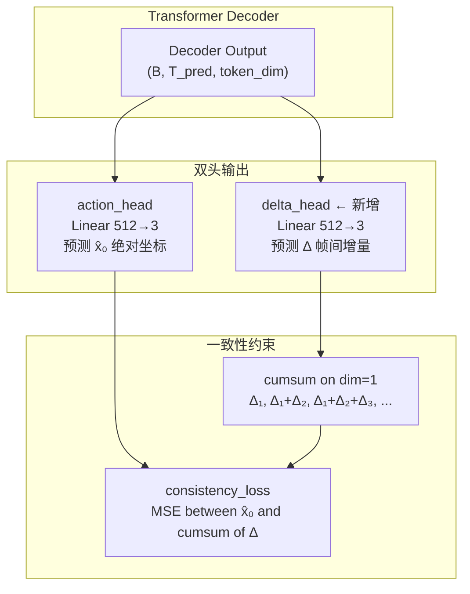
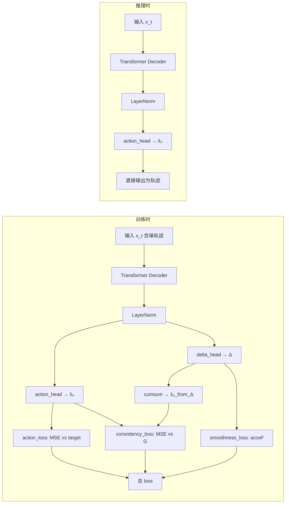

# 方案 C：混合表示（Hybrid Representation）实现计划

## 1. 动机与核心思想

### 1.1 问题回顾

NavDP 使用 **增量×4** 动作空间，网络预测的是帧间位移（~0.1m 量级），再通过 `cumsum/4` 累加为绝对坐标。这种设计天然具有平滑性保证——即使单步预测偏差较大，累加后的轨迹仍然是连续的。

Bridge-DP 使用 **绝对坐标** 动作空间，网络直接预测每个航点的全局位置（[-2, 2] 归一化值域）。这消除了累积误差，但丧失了增量空间的隐式平滑归纳偏置，可能在训练早期或困难场景下出现相邻航点跳变。

### 1.2 方案 C 核心思想

**让网络同时从两个视角预测轨迹**：主头预测绝对坐标 x̂₀，辅助头预测帧间增量 Δ。通过一致性 loss 强制两者自洽：

```
cumsum(Δ_pred) ≈ x̂₀_pred
```

这样：
- **主路径仍然是绝对坐标**（保留 Bridge-DP 无累积误差的优势）
- **增量辅助头提供隐式平滑正则**（天然约束相邻步连续性）
- **推理时只用主头输出**（不增加推理开销）

## 2. 架构修改总览



## 3. 需要修改的文件

| 文件 | 修改内容 |
|------|----------|
| `internnav/model/basemodel/bridgedp/bridgedp_policy.py` | 新增 `delta_head`；修改 `forward()` 返回增量预测；修改 `predict_x0()` |
| `internnav/trainer/bridgedp_trainer.py` | 新增 `consistency_loss` + `smoothness_loss` 计算 |
| `scripts/train/base_train/configs/bridgedp.py` | 新增 `lambda_consistency` 和 `lambda_smoothness` 超参 |

## 4. 详细实现步骤

### 4.1 修改 `bridgedp_policy.py` — 新增 delta_head

**位置**：`__init__` 方法，在 `self.action_head = nn.Linear(self.token_dim, 3)` 之后（约 line 195）

```python
# 输出头：预测干净轨迹 x̂_0（而非噪声 ε）
self.action_head = nn.Linear(self.token_dim, 3)
# 新增：增量辅助头（预测帧间位移 Δ，用于一致性约束）
self.delta_head = nn.Linear(self.token_dim, 3)
self.critic_head = nn.Linear(self.token_dim, 1)
```

**参数增加**：仅 `512 * 3 + 3 = 1539` 个参数（可忽略）。

### 4.2 修改 `bridgedp_policy.py` — 训练 forward 返回增量

**位置**：`forward()` 方法中 `x0_pred_ng = self.action_head(ng_output)` 之后（约 line 516）

```python
# no-goal 分支：预测 x̂_0
ng_output = self.decoder(tgt=ng_action_embeddings, memory=ng_cond_embeddings, tgt_mask=self.tgt_mask)
ng_output = self.layernorm(ng_output)
x0_pred_ng = self.action_head(ng_output)
delta_pred_ng = self.delta_head(ng_output)  # 新增：增量预测

# mixed-goal 分支：预测 x̂_0
mg_output = self.decoder(...)
mg_output = self.layernorm(mg_output)
x0_pred_mg = self.action_head(mg_output)
delta_pred_mg = self.delta_head(mg_output)  # 新增：增量预测
```

**修改 return**：在返回元组中追加 `delta_pred_ng` 和 `delta_pred_mg`

```python
return (
    x0_pred_ng,          # (B, T_pred, 3) 绝对坐标预测（ng）
    x0_pred_mg,          # (B, T_pred, 3) 绝对坐标预测（mg）
    cr_label_pred,       # (B,) critic
    cr_augment_pred,     # (B,) critic
    x0_ng,              # (B, T_pred, 3) 训练目标
    x0_mg,              # (B, T_pred, 3) 训练目标
    imagegoal_aux_pred,  # (B, 3) 辅助
    pixelgoal_aux_pred,  # (B, 3) 辅助
    shared_timesteps,    # (B,)
    tensor_theta_g,      # (B,)
    delta_pred_ng,       # (B, T_pred, 3) 增量预测（ng）← 新增
    delta_pred_mg,       # (B, T_pred, 3) 增量预测（mg）← 新增
)
```

### 4.3 `predict_x0()` 方法 — 推理路径不变

`predict_x0()` 只在推理去噪循环中调用，**不需要修改**。推理时只使用 `action_head` 输出，`delta_head` 仅训练时参与。

### 4.4 修改 `bridgedp_trainer.py` — 新增一致性损失

**位置**：`compute_loss()` 中前向传播返回值解包后（约 line 104-118）

**Step 1**：解包新增返回值

```python
(x0_pred_ng, x0_pred_mg,
 critic_pred, augment_pred,
 x0_target_ng, x0_target_mg,
 imagegoal_aux_pred, pixelgoal_aux_pred,
 shared_timesteps, tensor_theta_g,
 delta_pred_ng, delta_pred_mg) = model(...)  # 新增最后 2 个
```

**Step 2**：计算一致性损失（在 action_loss 之后，约 line 148）

```python
# ── 混合表示一致性约束 ─────────────────────────────────────────────
# 增量累加应与绝对坐标预测一致：cumsum(Δ) ≈ x̂₀
x0_from_delta_ng = torch.cumsum(delta_pred_ng, dim=1)  # (B, T, 3)
x0_from_delta_mg = torch.cumsum(delta_pred_mg, dim=1)  # (B, T, 3)

# 一致性 loss：主头与增量头的自洽性
consistency_ng = (x0_pred_ng - x0_from_delta_ng).square().mean(dim=-1)  # (B, T)
consistency_mg = (x0_pred_mg - x0_from_delta_mg).square().mean(dim=-1)  # (B, T)
consistency_loss = 0.5 * (
    (valid_mask * consistency_ng).sum() / valid_count
    + (valid_mask * consistency_mg).sum() / valid_count
)

# ── 加速度正则（从增量视角直接获得，更自然）───────────────────────
# 增量的一阶差分 = 加速度
accel_ng = delta_pred_ng[:, 1:] - delta_pred_ng[:, :-1]  # (B, T-1, 3)
accel_mg = delta_pred_mg[:, 1:] - delta_pred_mg[:, :-1]  # (B, T-1, 3)
smoothness_loss = 0.5 * (accel_ng.square().mean() + accel_mg.square().mean())
```

**Step 3**：修改总损失公式

```python
# ── 总损失（5 项）────────────────────────────────────────────────
loss = (0.8  * action_loss          # 主路径：逐点 MSE
      + 0.2  * critic_loss          # Critic 评分
      + 0.5  * aux_loss             # 辅助表征
      + 0.2  * terminal_loss        # 终点对齐
      + 0.15 * consistency_loss     # 双头一致性 ← 新增
      + 0.1  * smoothness_loss)     # 加速度正则 ← 新增
```

### 4.5 修改 `configs/bridgedp.py` — 超参数

```python
# 混合表示超参数
lambda_consistency=0.15,    # 一致性 loss 权重
lambda_smoothness=0.1,      # 加速度正则权重
```

## 5. 设计决策与理论分析

### 5.1 为什么用 `cumsum` 而非差分再积分？

```
方案 1: consistency = MSE(x̂₀, cumsum(Δ))     ← 选择此方案
方案 2: consistency = MSE(diff(x̂₀), Δ)       ← 不选
```

选择方案 1，因为：
- `cumsum(Δ)` 天然平滑（与 NavDP 的 cumsum/4 同源）
- 让绝对坐标头被增量头 "拉" 向平滑轨迹
- 方案 2 会让增量头被绝对坐标头 "拉"，但绝对头可能跳变，反而污染增量头

### 5.2 增量的监督目标是什么？

增量头 **不需要额外的显式监督标签**。它的学习信号完全来自：
1. **一致性 loss**：强制 `cumsum(Δ) ≈ x̂₀`
2. **加速度正则**：强制 Δ 序列本身平滑

这比给增量头加一个 `diff(x0_target)` 的 MSE 监督更好，因为：
- 避免了两个头同时被强制指向同一目标但从不同视角，可能冲突
- 让增量头自由地找到最优的内部分解方式

### 5.3 可选增强：增量头显式监督（作为 ablation）

如果实验发现纯一致性 loss 收敛慢，可以额外加：

```python
# 可选：显式增量监督
target_delta = x0_target[:, 1:] - x0_target[:, :-1]  # (B, T-1, 3)
# 第一步的增量 = 第一个航点本身（从原点出发）
target_delta_full = torch.cat([x0_target[:, :1], target_delta], dim=1)  # (B, T, 3)
delta_supervision_loss = (delta_pred - target_delta_full).square().mean()
```

## 6. 推理路径分析

### 6.1 推理时无任何额外开销

推理路径在 `predict_pointgoal_batch_action_vel` 和 `predict_nogoal_batch_action_vel` 中，调用的是 `predict_x0()`，该函数只使用 `self.action_head`，不涉及 `delta_head`。因此：

- ✅ 推理 FLOPs 不变
- ✅ 推理延迟不变
- ✅ 不需要修改任何推理代码

### 6.2 可选：推理时用增量头做 sanity check

```python
# 可选的推理后验证（debug 用途，不影响产出）
x0_from_delta = torch.cumsum(self.delta_head(output), dim=1)
inconsistency = (x0_pred - x0_from_delta).norm(dim=-1).mean()
if inconsistency > threshold:
    logger.warning(f"High inconsistency: {inconsistency:.4f}")
```

## 7. 数据流全景图



## 8. 实验验证计划

### 8.1 Ablation 实验矩阵

| 实验 | consistency_loss | smoothness_loss | delta 监督 | 预期 |
|------|:---:|:---:|:---:|------|
| Baseline | ❌ | ❌ | ❌ | 可能出现跳变 |
| +Smooth only | ❌ | ✅ | ❌ | 等价于方案 A |
| +Consistency only | ✅ | ❌ | ❌ | 主要验证双头思路 |
| **Full 方案 C** | ✅ | ✅ | ❌ | **期望最优** |
| +Delta supervision | ✅ | ✅ | ✅ | ablation：显式监督 |

### 8.2 评价指标

1. **轨迹平滑度**：相邻航点间加速度 L2 范数均值
2. **轨迹精度**：ATE（Absolute Trajectory Error）
3. **训练收敛速度**：到达目标 loss 的步数
4. **推理速度**：确认无退化

### 8.3 观测重点

- 训练早期（前 1000 步）的 `consistency_loss` 下降曲线
- `delta_pred` 的值域分布是否合理（应接近相邻帧差值）
- 困难场景（θ_g > 90°）的轨迹可视化对比

## 9. 风险与缓解

| 风险 | 概率 | 缓解措施 |
|------|------|----------|
| 双头冲突导致训练不稳定 | 低 | 一致性 loss 使用 stop_gradient 于 delta 分支 |
| delta_head 退化为全零 | 中 | 监控 delta_pred 的 L2 范数；必要时加最小方差约束 |
| 过强的一致性约束降低主头自由度 | 低 | lambda_consistency 从 0.05 起步逐渐增大 |
| 增量累加数值漂移 | 极低 | 24 步 cumsum 不会有数值问题 |

## 10. 实现 Todo List

1. **`bridgedp_policy.py` `__init__`**：新增 `self.delta_head = nn.Linear(self.token_dim, 3)`
2. **`bridgedp_policy.py` `forward()`**：ng/mg 分支各增加 `delta_pred = self.delta_head(output)`，修改返回元组
3. **`bridgedp_trainer.py` `compute_loss()`**：解包新返回值，新增 `consistency_loss` 和 `smoothness_loss` 计算
4. **`bridgedp_trainer.py` 总 loss**：加入 `+ λ_c * consistency_loss + λ_s * smoothness_loss`
5. **`bridgedp_trainer.py` 监控日志**：新增 `loss/consistency` 和 `loss/smoothness` 到 `_monitor_logs`
6. **`configs/bridgedp.py`**：新增 `lambda_consistency` 和 `lambda_smoothness` 配置项
7. **验证**：确认推理路径 `predict_x0()` 不受影响，无 delta_head 调用

---

*本计划保留 Bridge-DP 绝对坐标的所有优势（无累积误差、布朗桥先验、方向自适应方差），同时通过增量辅助头引入 NavDP 天然具有的平滑归纳偏置。*
