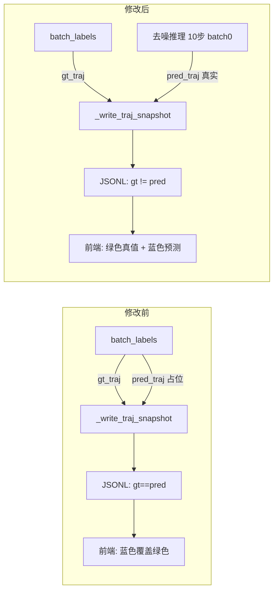

# 训练可视化：显示真实预测轨迹修改方案

## 问题回顾

两个 trainer 的 `_write_traj_snapshot` 调用中，`pred_traj` 字段传入的是真值 `batch_labels`，
导致前端蓝色（预测）轨迹与绿色（真值）轨迹完全重叠，只看到蓝色。

## 修改策略

每隔 `VIS_INTERVAL`（100）步，在 `compute_loss` 末尾额外执行一次 **单样本** 的去噪推理，
将推理结果作为真正的 `pred_traj` 传给 `_write_traj_snapshot`。

关键设计决策：
- **只取 batch 第 0 个样本**：避免 sample_num 倍的显存/计算开销
- **推理步数 10 步**（与 NavDP/BridgeDP 训练时间步数一致）
- **`torch.no_grad()` 包裹**：不影响梯度图
- **`model.eval()` / `model.train()` 切换**：避免 Dropout/BN 影响推理结果

---

## NavDP Trainer 修改

### 修改文件：`internnav/trainer/navdp_trainer.py`

**修改位置：`compute_loss` 方法，第 176–179 行**

```python
# 修改前（第 176–179 行）
rank = dist.get_rank() if dist.is_initialized() else 0
if rank == 0:
    ...
    gt_traj_abs = torch.cumsum(inputs_on_device["batch_labels"], dim=1)
    self._write_traj_snapshot(gt_traj_abs, gt_traj_abs, inputs_on_device["batch_labels"])
```

```python
# 修改后
VIS_INTERVAL = 100

rank = dist.get_rank() if dist.is_initialized() else 0
if rank == 0:
    ...
    gt_traj_abs = torch.cumsum(inputs_on_device["batch_labels"], dim=1)

    # 每 VIS_INTERVAL 步执行一次真实去噪推理，获得真正的预测轨迹
    if self._log_step_count % VIS_INTERVAL == 0:
        pred_traj_abs = self._infer_pred_traj_navdp(model, inputs_on_device)
    else:
        pred_traj_abs = gt_traj_abs  # 非可视化步仍用占位

    self._write_traj_snapshot(gt_traj_abs, pred_traj_abs, inputs_on_device["batch_labels"])
```

**新增方法 `_infer_pred_traj_navdp`（加在 `_write_traj_snapshot` 之前）：**

```python
def _infer_pred_traj_navdp(self, model, inputs_on_device):
    """对 batch[0] 执行去噪推理，返回绝对坐标预测轨迹 (B, T, 3)。

    推理步数 10（与训练一致），仅取第 0 个样本，
    结果 expand 到 batch size 以保持 _write_traj_snapshot 接口不变。
    """
    model_ref = model.module if hasattr(model, 'module') else model
    B = inputs_on_device["batch_labels"].shape[0]
    device = inputs_on_device["batch_labels"].device

    # 取第 0 个样本，构造 batch_size=1 的输入
    def s(t):
        return t[0:1]

    model_ref.eval()
    with torch.no_grad():
        pg = s(inputs_on_device["batch_pg"])
        pointgoal_embed = model_ref.point_encoder(pg).unsqueeze(1)
        rgbd_embed = model_ref.rgbd_encoder(
            s(inputs_on_device["batch_rgb"]),
            s(inputs_on_device["batch_depth"])
        )

        naction = torch.randn((1, model_ref.predict_size, 3), device=device)
        model_ref.noise_scheduler.set_timesteps(10)
        for k in model_ref.noise_scheduler.timesteps:
            noise_pred = model_ref.predict_noise(
                naction, k.to(device).unsqueeze(0), pointgoal_embed, rgbd_embed
            )
            naction = model_ref.noise_scheduler.step(
                model_output=noise_pred, timestep=k, sample=naction
            ).prev_sample

        pred_abs = torch.cumsum(naction / 4.0, dim=1)  # (1, T, 3)

    model_ref.train()
    # repeat 到 B，保持与 gt_traj_abs 形状一致（_write_traj_snapshot 按 B 遍历）
    return pred_abs.expand(B, -1, -1)
```

---

## BridgeDP Trainer 修改

### 修改文件：`internnav/trainer/bridgedp_trainer.py`

**修改位置：`compute_loss` 方法，第 166–173 行**

```python
# 修改前
self._write_traj_snapshot(
    inputs_on_device["batch_labels"],   # gt_traj
    inputs_on_device["batch_labels"],   # pred_traj ← 占位
    inputs_on_device["batch_prior"],
    inputs_on_device["batch_labels"],
    inputs_on_device["batch_theta_g"],
)
```

```python
# 修改后
VIS_INTERVAL = 100

if self._log_step_count % VIS_INTERVAL == 0:
    pred_traj = self._infer_pred_traj_bridgedp(model, inputs_on_device)
else:
    pred_traj = inputs_on_device["batch_labels"]  # 非可视化步仍用占位

self._write_traj_snapshot(
    inputs_on_device["batch_labels"],   # gt_traj
    pred_traj,                          # pred_traj ← 真实推理结果
    inputs_on_device["batch_prior"],
    inputs_on_device["batch_labels"],
    inputs_on_device["batch_theta_g"],
)
```

**新增方法 `_infer_pred_traj_bridgedp`（加在 `_write_traj_snapshot` 之前）：**

```python
def _infer_pred_traj_bridgedp(self, model, inputs_on_device):
    """对 batch[0] 执行布朗桥去噪推理，返回绝对坐标预测轨迹 (B, T, 3)。

    推理步数 10（与训练一致），仅取第 0 个样本，结果 expand 到 batch size。
    """
    model_ref = model.module if hasattr(model, 'module') else model
    B = inputs_on_device["batch_labels"].shape[0]
    device = inputs_on_device["batch_labels"].device

    def s(t):
        return t[0:1]

    model_ref.eval()
    with torch.no_grad():
        pg = s(inputs_on_device["batch_pg"])
        theta_g = s(inputs_on_device["batch_theta_g"])
        pg_n = model_ref._normalize_action(pg)

        pointgoal_embed = model_ref.point_encoder(pg_n).unsqueeze(1)
        rgbd_embed = model_ref.rgbd_encoder(
            s(inputs_on_device["batch_rgb"]),
            s(inputs_on_device["batch_depth"])
        )
        # 先验（use_prior_traj=False 时 gated_prior 为零）
        gated_prior = torch.zeros(
            1, model_ref.n_prior_tokens, model_ref.token_dim, device=device
        )

        bridge_endpoint = pg_n  # (1, 3)
        naction = model_ref.bridge_scheduler.sample_initial_noise(
            bridge_endpoint, (1, model_ref.predict_size, 3), device
        )
        endpoint_exp = bridge_endpoint.unsqueeze(1).expand(-1, model_ref.predict_size, -1)
        theta_exp = theta_g

        model_ref.bridge_scheduler.set_timesteps(10)
        for k in model_ref.bridge_scheduler.timesteps:
            eps_pred = model_ref.predict_noise(
                naction, k.to(device).unsqueeze(0),
                pointgoal_embed, rgbd_embed, gated_prior
            )
            x0_pred = model_ref._eps_to_x0(
                eps_pred, naction, k.to(device).unsqueeze(0),
                endpoint_exp, theta_exp
            )
            naction = model_ref.bridge_scheduler.step(
                x0_pred, naction, k, endpoint_exp, theta_exp
            )

        pred_abs = model_ref._denormalize_action(naction)  # (1, T, 3)

    model_ref.train()
    return pred_abs.expand(B, -1, -1)
```

---

## 数据流对比



---

## 开销估算

| 项目 | NavDP | BridgeDP |
|------|-------|----------|
| 推理步数 | 10（与训练一致） | 10（与训练一致） |
| 推理 batch size | 1（原 batch_size） | 1（原 batch_size） |
| 触发频率 | 每 100 步 1 次 | 每 100 步 1 次 |
| 额外显存 | 可忽略（no_grad） | 可忽略（no_grad） |
| 额外耗时 | ~1 次前向 × 10 步 | ~1 次前向 × 10 步 |

---

## 实施步骤

1. 在 `navdp_trainer.py` 的 `compute_loss` 中添加 `VIS_INTERVAL` 常量和条件分支
2. 在 `navdp_trainer.py` 中新增 `_infer_pred_traj_navdp` 方法
3. 在 `bridgedp_trainer.py` 的 `compute_loss` 中添加 `VIS_INTERVAL` 常量和条件分支
4. 在 `bridgedp_trainer.py` 中新增 `_infer_pred_traj_bridgedp` 方法
5. 验证：训练运行 100 步后，检查 `traj_batches.jsonl` 中 `gt_traj` 与 `pred_traj` 是否不同
